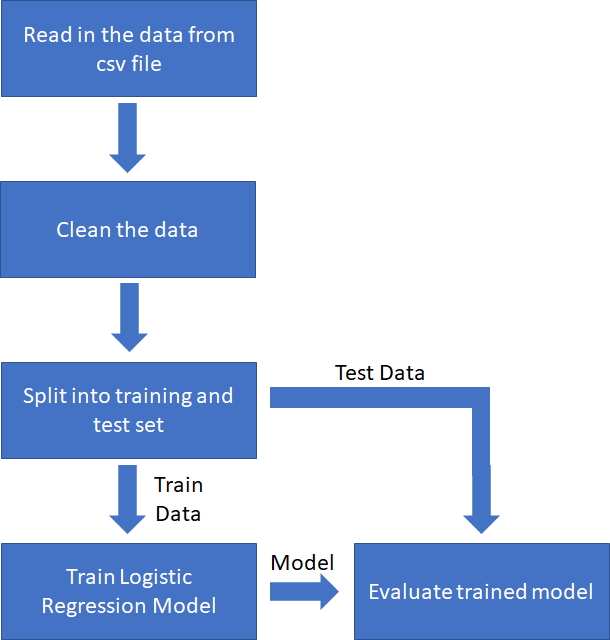
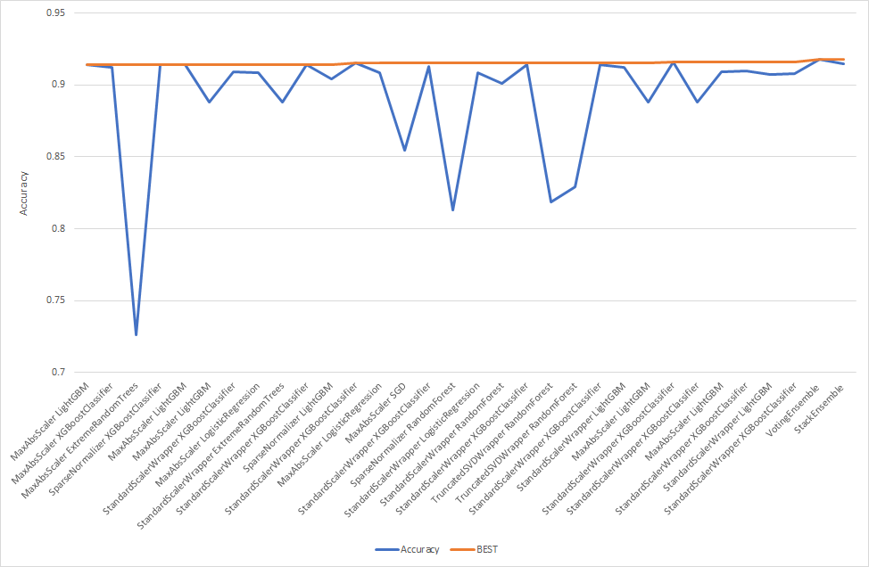
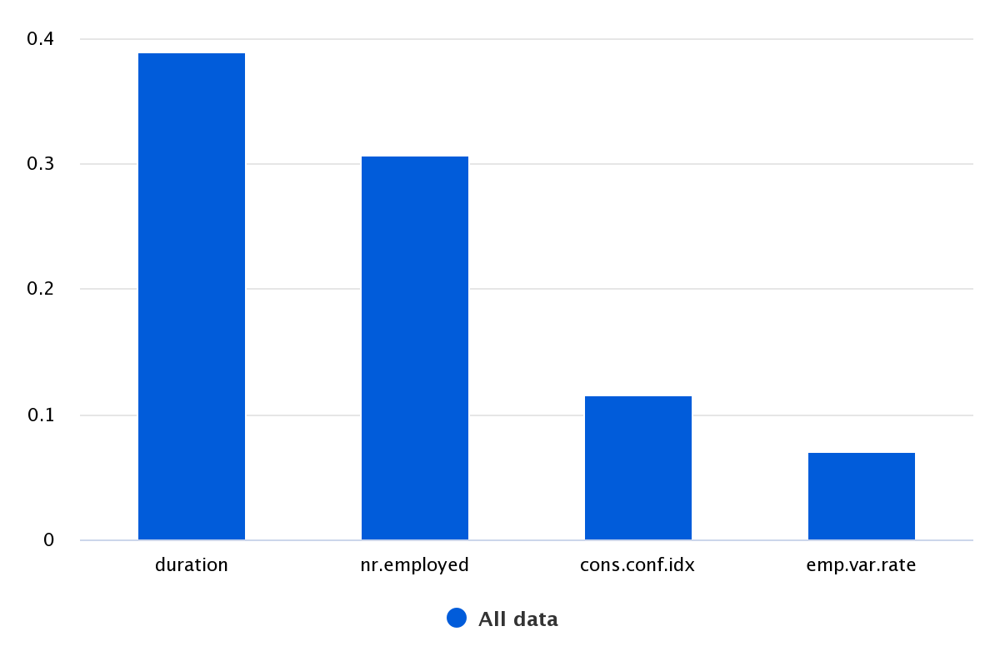
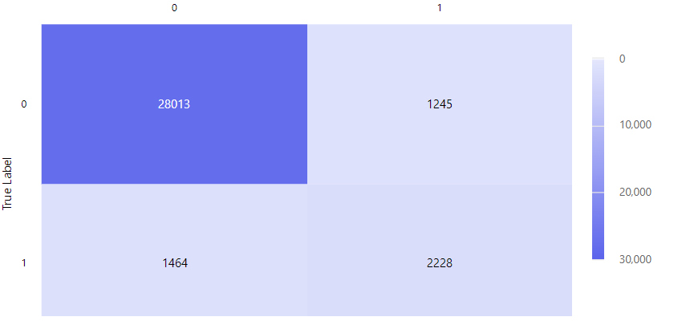

# Optimizing an ML Pipeline in Azure

## Overview
This project is part of the Udacity Azure ML Nanodegree.
In this project, we build and optimize an Azure ML pipeline using the Python SDK and a provided Scikit-learn model.
This model is then compared to an Azure AutoML run.

## Useful Resources
- [ScriptRunConfig Class](https://docs.microsoft.com/en-us/python/api/azureml-core/azureml.core.scriptrunconfig?view=azure-ml-py)
- [Configure and submit training runs](https://docs.microsoft.com/en-us/azure/machine-learning/how-to-set-up-training-targets)
- [HyperDriveConfig Class](https://docs.microsoft.com/en-us/python/api/azureml-train-core/azureml.train.hyperdrive.hyperdriveconfig?view=azure-ml-py)
- [How to tune hyperparamters](https://docs.microsoft.com/en-us/azure/machine-learning/how-to-tune-hyperparameters)

## Summary
**In 1-2 sentences, explain the problem statement: e.g "This dataset contains data about... we seek to predict..."**

This dataset contains data about customers of a financial institution. It is used to predict whether a customer will subscribe to a fixed term deposit.

**In 1-2 sentences, explain the solution: e.g. "The best performing model was a ..."**

The best performing model was a Voting Ensemble generated by AutoML. The Voting Ensemble is only marginally better than the Logistic Regression model from Hyperdrive or many of the other AutoML models.

## Scikit-learn Pipeline
**Explain the pipeline architecture, including data, hyperparameter tuning, and classification algorithm.**'

The Scikit-learn pipeline reads in the data from a website csv file. The data is then cleaned as follows:
* Variables that contain Yes/No answers i.e. default, housing, loan and poutcome are mapped to binary variables
* The marital variable is also mapped to a binary variable
* The job, contact and education variables are converted to indicator variables
* Month and day of the week variables are mapped to integers

The data is then split into a training and test dataset. 50% of the data is in training and 50% in the test set.

The hyperparameters that are tuned are the inverse regularization strength and the maximum number of interations to converge. The classification algorithm is Logistic regression which predicts whether a customer will subscribe to a fixed term deposit or not.

**What are the benefits of the parameter sampler you chose?**

A random sampling method was chosed to find the values. This method is quick compared to a grid search and normally results in similar accuracies.

**What are the benefits of the early stopping policy you chose?**

Early termination prevents experiments from running a long time and using up resources. 

## AutoML
**In 1-2 sentences, describe the model and hyperparameters generated by AutoML.**

AutoML generated a total of 31 models. The best performing model was a Voting Ensemble. However, the improvement was marginal with many of the models achieving similar accuracies. (see graph below)

The 4 most important features are shown in the chart below.

## Pipeline comparison
**Compare the two models and their performance. What are the differences in accuracy? In architecture? If there was a difference, why do you think there was one?**

The Voting Ensemble and Logistic Regression model obtain similar accuracies (91.7% vs. 91.5%). Whilst the Voting Ensemble consists of many models that each contribute to the final decision the logistic regression model is simpler. 

## Future work
**What are some areas of improvement for future experiments? Why might these improvements help the model?**
Looking at the confusion matrix for the best model we see that many of the positive cases are misclassified. This is because there are few examples of positive cases. In future experiments it would be better to create a balanced dataset or include class weighting when training the model to decrease model bias.

